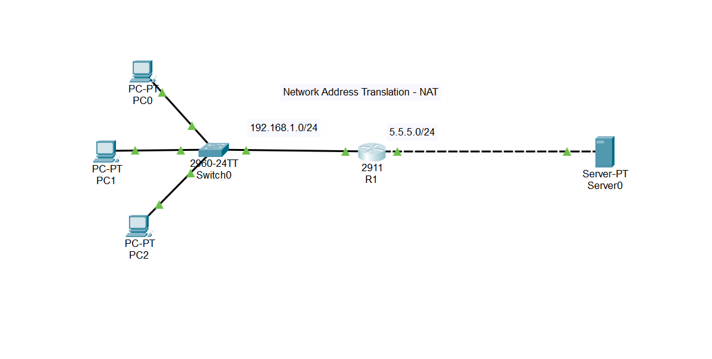

# Network Address Translation (NAT) Lab

> **Author:** Amirhossein Tavakoli
> **Tool:** Cisco Packet Tracer
> **Level:** Intermediate

---

## 📋 Overview

This lab demonstrates the implementation of Network Address Translation (NAT), allowing private IP addresses to communicate with external networks through a public IP address.

---

## 🖧 Topology



---

## 🎯 Objectives

- Configure Inside and Outside interfaces
- Configure Dynamic NAT
- Configure NAT access lists
- Verify address translation
- Test connectivity to external network

---

## 🔧 Devices Used

| Device | Model | Role |
|--------|-------|------|
| R1 | Cisco 2911 | NAT Router |
| Switch0 | Cisco 2960 | LAN Switch |
| PC0 | PC-PT | Internal Host |
| PC1 | PC-PT | Internal Host |
| PC2 | PC-PT | Internal Host |
| Server0 | Server-PT | External Server |

---

## ⚙️ Key Configurations

### NAT Configuration

```bash
Router(config)# access-list 1 permit 192.168.1.0 0.0.0.255

Router(config)# ip nat pool PUBLIC 5.5.5.2 5.5.5.10 netmask 255.255.255.0

Router(config)# ip nat inside source list 1 pool PUBLIC
```

### Interface Configuration

```bash
Router(config)# interface g0/0
Router(config-if)# ip nat inside

Router(config)# interface g0/1
Router(config-if)# ip nat outside
```

---

## ✅ Verification Commands

```bash
Router# show ip nat translations
Router# show ip nat statistics
Router# show access-lists
Router# ping 5.5.5.2
```

---

## 🌐 Network Addressing

| Network | Purpose |
|---------|---------|
| 192.168.1.0/24 | Private LAN |
| 5.5.5.0/24 | Public Network |

---

## 📁 Files

| File | Description |
|------|-------------|
| `nat-lab.pkt` | Cisco Packet Tracer project |
| `topology.png` | Network topology |

---

## 📚 Concepts Covered

- Network Address Translation (NAT)
- Inside & Outside Interfaces
- Dynamic NAT
- NAT Pool
- Access Control Lists (ACL)
- Private & Public Address Translation 
